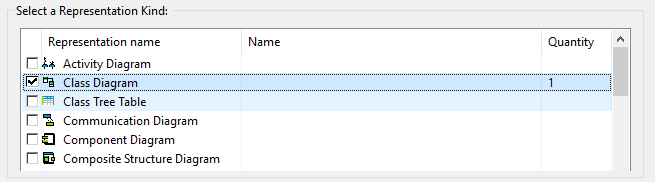

# ma
TP1 de ES - Monitor de Alarmes

## Ferramentas:
* Java 8
* [IDE Eclipse](https://eclipse.org/downloads/) (estou usando a versão 4.7.3a)
* plugin Git integration fo Eclipse (opcional)
* plugin Papyrus for UML

Geralmente, o plugin Git já vem instalado por padrão. 

## Instalar o plugin Papyrus:
1. Clique no menu Help->Install new software.
2. No item Work with, escolha All Available Sites.
3. Após carregar a lista, vá para Modeling e marque a opção Papyrus UML. Clique em Next.
4. Aceite os temos de licença e clique em Finish.
5. Após a instalação, reinicie a IDE.

## Importar o projeto para a IDE
Existem vários caminhos para importar o projeto para a IDE. Você pode usar sua ferramenta git para cloná-lo e, em seguida, importá-lo.

Ou, caso você não tenha uma ferramenta git instalada em seu computador e tenha o plugin git instalado no Eclipse:
1. Clicar no menu File->Import.

2. Escolha a pasta Git e a opção Projects from Git e clique em Next.

3. Escolha Clone URI e clique em Next.

4. Cole a URI https://github.com/douglasralmeida/ma.git
   Digite seu usuário e senha nos campos User e Password e clique em Next.

5. Escolha o ramo 'master' e clique em Next.

6. Escolha um diretório de destino de sua preferência no seu computador e clique em Finish.

## Criando um diagrama no Papyrus
Para criar um diagrama, vá o menu File->New->Papyrus Model.

Marque todas as opções de Architecture Views e clique em Next.

Escolha a pasta modelling e dê um nome para o arquivo do diagrama.

Escolha o modelo de representação e clique em Finish.

Para editar, mude para a prespectiva Papyrus. A paleta de design fica escondida em uma seta no lado esquerdo superior do diagrama.

## Atalhos úteis
[Documentos do Projeto no Google Drive](https://drive.google.com/open?id=1DQdbmIjsad0fb2MR4ULzpa1fVn4TUJfvn8lNxCa2NN4)

[Site da Disciplina no DCC](http://homepages.dcc.ufmg.br/~figueiredo/disciplinas/2018a/dcc603.htm)